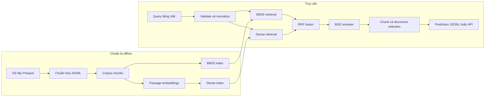

# R2AI Medical Retrieval

Hệ thống truy xuất thông tin y khoa đa ngôn ngữ dành cho câu hỏi tiếng Việt. Dự án nhận một truy vấn, tìm các đoạn văn liên quan trong kho tài liệu và trả về danh sách `document_id` cùng `chunk_id`. Pipeline không sinh câu trả lời mới.

Giải pháp kết hợp bốn tầng truy xuất:

1. **BM25** tìm theo từ khóa và thuật ngữ chính xác.
2. **BGE-M3 dense retrieval** tìm theo ngữ nghĩa.
3. **Reciprocal Rank Fusion (RRF)** hợp nhất kết quả sparse và dense.
4. **BGE reranker** xếp hạng lại nhóm ứng viên cuối.

> [!IMPORTANT]
> Đây là dự án nghiên cứu và đánh giá retrieval. Kết quả của hệ thống không phải chẩn đoán, chỉ định điều trị hoặc tư vấn y khoa.

## Mục lục

- [Tính năng chính](#tính-năng-chính)
- [Kiến trúc](#kiến-trúc)
- [Cấu trúc dự án](#cấu-trúc-dự-án)
- [Yêu cầu hệ thống](#yêu-cầu-hệ-thống)
- [Chạy nhanh với demo](#chạy-nhanh-với-demo)
- [Chạy pipeline ViMed đầy đủ](#chạy-pipeline-vimed-đầy-đủ)
- [Chạy bằng Docker](#chạy-bằng-docker)
- [CLI, API và giao diện](#cli-api-và-giao-diện)
- [Đánh giá và tạo submission](#đánh-giá-và-tạo-submission)
- [Cấu hình](#cấu-hình)
- [Kiểm thử và phát triển](#kiểm-thử-và-phát-triển)
- [Kết quả tham khảo](#kết-quả-tham-khảo)
- [Xử lý lỗi thường gặp](#xử-lý-lỗi-thường-gặp)
- [Tài liệu](#tài-liệu)

## Tính năng chính

- Truy xuất sparse bằng BM25 với index lưu trên đĩa.
- Truy xuất dense đa ngôn ngữ bằng Sentence Transformers.
- Exact vector search và cấu hình dành cho FAISS.
- Hybrid retrieval bằng RRF.
- Cross-encoder reranking bằng `BAAI/bge-reranker-v2-m3`.
- Chọn kết quả ở cả cấp chunk và document.
- Kiểm tra quan hệ giữa chunk và document cha.
- Batch CLI, JSON API và giao diện so sánh trực quan.
- Đánh giá Precision, Recall, Macro F2, Recall@K và MRR.
- Manifest, checksum corpus và revision model để tái lập thí nghiệm.
- Docker Compose với CUDA và NVIDIA GPU.

## Kiến trúc



Pipeline được điều khiển bằng YAML. Mỗi cấu hình khóa đường dẫn corpus/index, model revision, thiết bị, độ sâu truy xuất và quy tắc chọn kết quả.

## Cấu trúc dự án

```text
medical-rag/
├── artifacts/          # BM25 index và dense index sinh trong quá trình chạy
├── configs/            # Cấu hình demo, BM25, dense, hybrid và reranker
├── data/               # Dữ liệu mẫu, dữ liệu thô và dữ liệu đã chuẩn hóa
├── docker/             # Dependency và constraint cho Docker image
├── docs/               # Thiết kế, quy trình và báo cáo nghiên cứu
├── experiments/        # Nhật ký thí nghiệm
├── outputs/            # Prediction, metric, benchmark và human labels
├── scripts/            # Chuẩn bị dữ liệu, build index, benchmark, evaluate
├── src/
│   ├── adapters/       # Chuẩn hóa input
│   ├── data/           # Schema, loader và validator
│   ├── evaluation/     # Precision, Recall, F2 và ranking metrics
│   ├── indexing/       # Sparse index utilities
│   ├── reranking/      # BGE reranker
│   ├── retrieval/      # BM25, dense, hybrid và RRF
│   ├── scoring/        # Tổng hợp điểm document
│   ├── selection/      # Threshold và giới hạn kết quả
│   ├── submission/     # Build và validate submission
│   ├── api.py          # JSON API
│   └── inspector.py    # Giao diện so sánh retrieval
├── tests/              # Bộ kiểm thử
├── compose.yaml
├── Dockerfile
├── Makefile
└── pyproject.toml
```

Các thư mục `data/`, `artifacts/`, `.cache/huggingface/` và `outputs/` chứa artifact cục bộ. Không nên giả định các file model hoặc index lớn đã có sẵn sau khi clone repository.

## Yêu cầu hệ thống

### Chạy demo hoặc BM25

- Python 3.11 trở lên.
- `pip` và môi trường ảo Python.
- Bộ nhớ phù hợp với kích thước corpus khi chạy BM25 toàn bộ dữ liệu.

### Chạy dense, hybrid hoặc reranker

- NVIDIA GPU có CUDA được khuyến nghị.
- Driver NVIDIA tương thích với CUDA 12.8 nếu dùng Docker image của dự án.
- Dung lượng đĩa cho model Hugging Face, dense index và kết quả benchmark.
- Kết nối mạng ở lần tải model đầu tiên, hoặc cache model đã chuẩn bị sẵn.

### Chạy Docker

- Docker Engine hoặc Docker Desktop có Compose v2.
- NVIDIA Container Toolkit và quyền truy cập GPU từ container.
- Linux `amd64` hoặc môi trường có thể chạy image `linux/amd64`.

## Chạy nhanh với demo

Luồng demo dùng dữ liệu nhỏ trong `data/dev/`, không tải model và không cần GPU.

### 1. Tạo môi trường

Linux/macOS:

```bash
cd medical-rag
python3 -m venv .venv
source .venv/bin/activate
python -m pip install --upgrade pip
python -m pip install -e ".[api,dev]"
```

Windows PowerShell:

```powershell
cd medical-rag
py -3.11 -m venv .venv
.venv\Scripts\Activate.ps1
python -m pip install --upgrade pip
python -m pip install -e ".[api,dev]"
```

### 2. Khởi động JSON API

Linux/macOS:

```bash
R2AI_CONFIG=configs/demo.yaml \
python -m uvicorn src.api:create_app --factory --host 0.0.0.0 --port 8000
```

Windows PowerShell:

```powershell
$env:R2AI_CONFIG = "configs/demo.yaml"
python -m uvicorn src.api:create_app --factory --host 0.0.0.0 --port 8000
```

Kiểm tra service:

```bash
curl http://127.0.0.1:8000/health
```

Gửi một truy vấn:

```bash
curl -X POST http://127.0.0.1:8000/search \
  -H "Content-Type: application/json" \
  -d '{"id":"demo-001","query":"Triệu chứng thường gặp của tăng huyết áp là gì?"}'
```

Tài liệu tương tác của FastAPI có tại <http://127.0.0.1:8000/docs>.

## Chạy pipeline ViMed đầy đủ

Các lệnh trong phần này được chạy từ thư mục `medical-rag/`.

### 1. Cài toàn bộ dependency

```bash
python -m pip install -e ".[api,retrieval,dev]"
```

Torch trong môi trường local phải phù hợp với CPU hoặc phiên bản CUDA của máy. Cấu hình ViMed đã chọn sử dụng `device: cuda` và `float16`.

### 2. Chuẩn bị dữ liệu nguồn

Đặt các file ViMedAQA Parquet vào:

```text
data/raw/vimedaqa/all/
├── train-*.parquet
├── validation-*.parquet
└── test-*.parquet
```

Chuẩn hóa corpus, query, ground truth và tạo BM25 index:

```bash
python -m scripts.prepare_vimed
python -m scripts.prepare_vimed_validation
```

Artifact chính được tạo ra:

```text
data/vimed/chunks.jsonl
data/vimed/queries.jsonl
data/vimed/validation/samples.jsonl
artifacts/vimed_bm25/index.json
```

### 3. Build và kiểm tra dense index

```bash
export HF_HOME="$PWD/.cache/huggingface"
python -m scripts.build_dense_index \
  --config configs/vimed_dense_bge_m3.yaml \
  --timeout-seconds 3600
python -m scripts.verify_dense_index
```

PowerShell dùng biến môi trường tương đương:

```powershell
$env:HF_HOME = Join-Path (Get-Location) ".cache/huggingface"
python -m scripts.build_dense_index --config configs/vimed_dense_bge_m3.yaml --timeout-seconds 3600
python -m scripts.verify_dense_index
```

Script build từ chối ghi đè dense index đã tồn tại. Nếu index đã có, chạy bước verify để kiểm tra tính tương thích với corpus và model revision.

### 4. Chạy benchmark validation

Chạy tuần tự vì các stage sau dùng kết quả của stage trước:

```bash
python -m scripts.benchmark_vimed_validation --stage bm25 --timeout-seconds 1200
python -m scripts.benchmark_vimed_validation --stage dense --timeout-seconds 1200
python -m scripts.benchmark_vimed_validation --stage hybrid --timeout-seconds 1200
python -m scripts.benchmark_vimed_validation --stage rerank --timeout-seconds 7200
```

Kết quả được ghi vào `outputs/vimed_validation/<stage>/`. Khi thay dữ liệu hoặc cấu hình, hãy dùng `--output` mới để không trộn các experiment khác nhau.

### 5. Mở giao diện inspector

```bash
export HF_HOME="$PWD/.cache/huggingface"
export HF_HUB_OFFLINE=1
python -m uvicorn src.inspector:create_app \
  --factory \
  --host 127.0.0.1 \
  --port 8001 \
  --workers 1
```

Mở <http://127.0.0.1:8001>. Giao diện hỗ trợ:

- so sánh BM25, dense, hybrid và hybrid + reranker;
- phát lại benchmark đã lưu hoặc chạy truy vấn live;
- lọc các câu retrieval bị trượt;
- xem context nguồn và điểm từng stage;
- lưu nhãn đánh giá thủ công vào `outputs/vimed_validation/human_labels.jsonl`.

Chỉ chạy một worker để tránh tải nhiều bản sao của model lên GPU.

## Chạy bằng Docker

Docker image sử dụng PyTorch `2.7.1`, CUDA `12.8` và khởi động ViMed inspector trên cổng `8001`.

### 1. Chuẩn bị artifact trên máy host

Compose mount trực tiếp bốn thư mục sau vào container:

```text
data/
artifacts/
outputs/
.cache/huggingface/
```

Trước khi chạy container, cần hoàn thành phần [Chạy pipeline ViMed đầy đủ](#chạy-pipeline-vimed-đầy-đủ), tối thiểu gồm:

- `data/vimed/chunks.jsonl` và `data/vimed/validation/samples.jsonl`;
- `artifacts/vimed_bm25/`;
- dense index nếu chạy dense, hybrid hoặc reranker;
- model đúng revision trong `.cache/huggingface/`, hoặc cho phép container tải model.

Tạo các thư mục mount nếu chưa có:

```bash
mkdir -p data artifacts outputs .cache/huggingface
```

### 2. Build và chạy

Nếu model đã có trong cache:

```bash
HF_HUB_OFFLINE=1 docker compose up -d --build
```

Nếu cần tải model ở lần chạy đầu:

```bash
HF_HUB_OFFLINE=0 docker compose up -d --build
```

Theo dõi quá trình khởi động và kiểm tra health:

```bash
docker compose logs -f ui
curl http://127.0.0.1:8001/health
```

Mở <http://127.0.0.1:8001> khi health check trả về `"status":"ok"`.

### 3. Đổi cổng

Linux/macOS:

```bash
UI_PORT=8002 docker compose up -d
```

Windows PowerShell:

```powershell
$env:UI_PORT = "8002"
docker compose up -d
```

Sau đó mở <http://127.0.0.1:8002>.

### 4. Dừng service

```bash
docker compose down
```

`data/` và `artifacts/` được mount read-only. `outputs/` và cache Hugging Face được giữ trên máy host nên không mất khi container bị xóa.

## CLI, API và giao diện

### CLI

```bash
python -m src.cli --help
python -m src.cli validate-config configs/vimed_selected_validation.yaml
python -m src.cli retrieve \
  --config configs/vimed_selected_validation.yaml \
  --queries data/vimed/validation/queries.jsonl \
  --output outputs/predictions/vimed_validation.jsonl
```

### JSON API với pipeline tùy chọn

```bash
R2AI_CONFIG=configs/vimed_selected_validation.yaml \
python -m uvicorn src.api:create_app --factory --host 0.0.0.0 --port 8000 --workers 1
```

Endpoints:

| Method | Endpoint | Mô tả |
|---|---|---|
| `GET` | `/health` | Trạng thái service và backend đang dùng |
| `POST` | `/search` | Nhận query và trả document/chunk IDs |
| `GET` | `/docs` | OpenAPI UI của FastAPI |

Request:

```json
{
  "id": "Q001",
  "query": "Cần làm gì khi tắc nghẽn đường tiết niệu do sỏi thận?"
}
```

Response:

```json
{
  "id": "Q001",
  "relevant_docs": ["doc_..."],
  "relevant_chunks": ["ctx_..."]
}
```

## Đánh giá và tạo submission

### Batch retrieval

```bash
python -m scripts.retrieve \
  --config configs/vimed_selected_validation.yaml \
  --queries data/vimed/validation/queries.jsonl \
  --output outputs/predictions/vimed_validation.jsonl
```

### Evaluate

```bash
python -m scripts.evaluate \
  --prediction outputs/predictions/vimed_validation.jsonl \
  --ground-truth data/vimed/validation/ground_truth.jsonl \
  --corpus-chunks data/vimed/chunks.jsonl \
  --output-json outputs/predictions/vimed_validation_metrics.json \
  --experiment-name vimed_validation \
  --log-csv experiments/experiment_log.csv
```

### Build và validate submission

```bash
python -m scripts.make_submission \
  --predictions outputs/predictions/vimed_validation.jsonl \
  --chunks data/vimed/chunks.jsonl \
  --queries data/vimed/validation/queries.jsonl \
  --output outputs/submissions/submission.jsonl

python -m src.cli validate outputs/submissions/submission.jsonl \
  --corpus-chunks data/vimed/chunks.jsonl \
  --test-queries data/vimed/validation/queries.jsonl
```

Validator kiểm tra query thiếu hoặc thừa, ID không tồn tại, ID trùng và quan hệ giữa chunk với document cha.

## Cấu hình

| File | Backend | Mục đích |
|---|---|---|
| `configs/demo.yaml` | Demo | Smoke test không cần model hoặc GPU |
| `configs/vimed_bm25.yaml` | Sparse | Baseline BM25 cho ViMed |
| `configs/vimed_dense_bge_m3.yaml` | Dense | BGE-M3 exact dense retrieval |
| `configs/vimed_hybrid.yaml` | Hybrid | BM25 + BGE-M3 + RRF |
| `configs/vimed_hybrid_rerank.yaml` | Hybrid | Hybrid + BGE reranker |
| `configs/vimed_selected_validation.yaml` | Hybrid | Cấu hình được chọn trên validation |

Các đường dẫn tương đối trong YAML được tính từ thư mục chứa file cấu hình. Schema từ chối field không hợp lệ và kiểm tra quan hệ giữa backend, retriever, fusion, reranker và selection khi load.

## Kiểm thử và phát triển

Chạy toàn bộ test:

```bash
pytest -q
```

Hoặc dùng Makefile:

```bash
make test
make lint
make format
```

Trước khi tạo experiment mới:

1. Giữ nguyên test split và chỉ chọn tham số trên validation.
2. Tạo file config mới thay vì sửa kết quả cũ mà không đổi tên.
3. Ghi prediction, metric, manifest và thông tin phần cứng vào thư mục output riêng.
4. Kiểm tra submission bằng validator trước khi sử dụng.

## Kết quả tham khảo

Benchmark validation hiện có 2.210 câu và 17.955 context đã khử trùng lặp:

| Cấu hình | Recall@5 | Recall@10 | Recall@100 |
|---|---:|---:|---:|
| BM25 | 69,19% | 75,25% | 88,37% |
| BGE-M3 dense | 76,61% | 81,63% | 92,22% |
| Hybrid RRF | 77,19% | 82,26% | 92,49% |
| Hybrid + reranker | 88,64% | 90,63% | 92,49% |

Ground truth của benchmark là context nguồn được suy ra từ dữ liệu QA, chưa phải tập nhãn relevance đầy đủ. Một context khác có thể phù hợp nhưng chưa được đánh dấu positive. Các con số trên dùng để so sánh nội bộ, không thể hiện mức độ an toàn lâm sàng.

## Xử lý lỗi thường gặp

### `Missing ... data/vimed/...`

Chưa có dữ liệu đã chuẩn hóa. Chạy:

```bash
python -m scripts.prepare_vimed
python -m scripts.prepare_vimed_validation
```

### `HF_HUB_OFFLINE` nhưng không tìm thấy model

Cache chưa chứa đúng model revision. Cho phép tải model một lần bằng cách bỏ biến này hoặc đặt:

```bash
export HF_HUB_OFFLINE=0
```

Sau khi tải xong có thể chuyển lại `HF_HUB_OFFLINE=1` để chạy tái lập từ cache.

### Không tìm thấy GPU trong Docker

Kiểm tra host trước:

```bash
nvidia-smi
docker run --rm --gpus all nvidia/cuda:12.8.0-base-ubuntu22.04 nvidia-smi
```

Nếu lệnh thứ hai thất bại, cài hoặc cấu hình lại NVIDIA Container Toolkit trước khi chạy Compose.

### Cổng `8001` đang được sử dụng

Đặt `UI_PORT` sang cổng khác như hướng dẫn trong phần Docker, hoặc đổi `--port` khi chạy Uvicorn local.

### Dense index không khớp corpus hoặc model

Không tái sử dụng index từ corpus hoặc encoder khác. Giữ index cũ để đối chiếu, chọn một thư mục output mới, build lại rồi chạy:

```bash
python -m scripts.verify_dense_index --config configs/vimed_dense_bge_m3.yaml
```

## Tài liệu

- [Project brief](docs/00_project_brief.md)
- [Pipeline và workflow](docs/pipeline_workflow_presentation_vi.md)
- [Encoder profile và dense verification](docs/encoder_profiles_vi.md)
- [Review workflow](docs/workflow_review_vi.md)
- [Review ViMed retrieval](docs/vimed_retrieval_review_vi.md)
- [Kế hoạch cải thiện](docs/improvement_plan_vi.md)
- [Nhật ký nghiên cứu](docs/01_research_log.md)
