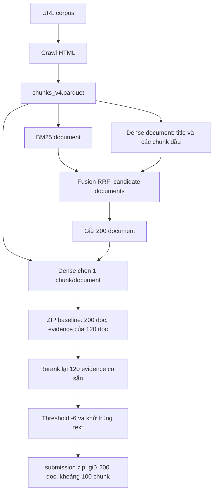

# Review luồng và precision ViBioMIR — 07/10/2026

Precision thấp có nguyên nhân rõ trong cách chọn kết quả cuối: ZIP mang tên
`submission.zip` vẫn xuất 200 document/câu, trong khi reranker chỉ chấm một
chunk đã được chọn sẵn của 120 document/câu. Ngưỡng `-6` giữ phần lớn pool;
reranker chưa được dùng để chọn lại document hoặc tìm passage khác. Tăng
precision cần sửa các quyết định này trước khi tăng quy mô crawl hoặc đổi model.

Đã kiểm tra trực tiếp 5 ZIP, đọc toàn bộ 144.000 score trong cache và replay
selector trên đủ 1.200 câu. Cả 5 ZIP qua validator hiện có và kiểm tra CRC.
Không có qrels hay scorer chính thức để tính lại relevance. Điểm dưới đây do
người dùng cung cấp; chưa có checksum của file đã upload để chứng minh ảnh
thuộc đúng ZIP local nào.

**Các file thực sự đang có.** “Mới nhất mang tên `submission.zip`” và “ZIP mới
nhất trong thư mục” là hai artifact khác nhau:

| Artifact | Thời gian sửa, giờ Việt Nam | MB, hệ thập phân | Doc/câu | Chunk/câu |
|---|---|---:|---:|---:|
| `outputs/submissions/vibiomir_test_best_20261006.zip` | 06/10 14:26 | 44,16 | 200 | 120 |
| `outputs/submissions/vibiomir_taxonomy_test_20261006.zip` | 06/10 15:36 | 44,05 | 200 | 120 |
| `outputs/evidence/test_20261006/selected/submission.zip` | 06/10 16:57 | 39,31 | 200 | 100,22 |
| `outputs/submissions/vibiomir_probes_20261007/vibiomir_rerank80_exact_20261007.zip` | 07/10 07:23:27 | 21,35 | 80 | 59,91 |
| `outputs/submissions/vibiomir_probes_20261007/vibiomir_rerank80_window1_20261007.zip` | 07/10 07:23:42 | 44,94 | 80 | 59,91 |

SHA-256 của `submission.zip` local:
`ccf612d647bfd466b871e2c7d9a575c5c429888f2a5ad7143186699c4a89c083`.
ZIP mới nhất là bản `window1`, không phải kết quả của lượt extraction đang chạy.
File ghi kết quả leaderboard hiện chưa có điểm cho hai bản `exact/window1`.

**Đọc các chỉ số trong ảnh.**

| Chỉ số | Điểm |
|---|---:|
| FINAL_SCORE | 0,1443 |
| DOCS_F2MACRO | 0,2347 |
| CHUNKS_F2MACRO | 0,0538 |
| DOCS_PRECISION | 0,1246 |
| DOCS_RECALL | 0,3866 |
| CHUNKS_PRECISION | 0,0430 |
| CHUNKS_RECALL | 0,0722 |

Document precision 12,46% cho thấy danh sách xuất ra chứa nhiều document không
được scorer ghi nhận là liên quan. Chunk precision 4,30% và recall 7,22% cùng
thấp: có cả vấn đề chọn evidence không phù hợp và bỏ sót evidence đúng. Điểm
chunk thấp hơn nhiều điểm document nên chất lượng passage là ưu tiên lớn.
Điểm cuối khớp trung bình hai F2 sau làm tròn; đây là đối chiếu số trong ảnh,
chưa xác minh công thức tổng hợp của chương trình chấm.

Nếu ảnh thuộc đúng ZIP 200 doc/câu và precision được tính macro trên tập ID,
trung bình khoảng `200 × 0,1246 = 24,92` document/câu được ghi nhận đúng. Không
áp dụng phép nhân tương tự cho chunk vì số chunk/câu thay đổi. Không suy số
gold hoặc cutoff tối ưu bằng tỷ số macro precision/recall.

**Luồng tạo bản `submission.zip` đang được review.**



`pack_cached_submission.py:102–143` chọn một chunk có dense similarity cao
nhất trong mỗi document rồi lấy evidence theo cutoff. `test_evidence_submission.py`
đối chiếu text với corpus và rerank chính các evidence có trong ZIP baseline.
Nó không lấy thêm chunk khác của cùng document. `evidence_selector.py:109–110`
giữ nguyên danh sách document khi `document_mode=baseline`.

**1. Document selection chưa được sửa — tác động trực tiếp đến precision.**

So sánh baseline với `submission.zip`: **0/1.200 câu thay đổi tập document**,
0 câu thay đổi thứ tự document; bỏ 23.738 evidence và thêm 0 evidence. Cache
có đúng 120 document/câu, một chunk/document. Còn 80 document/câu chưa có
reranker score nhưng vẫn được xuất trong cả 1.200 câu. Sau filtering, có
119.738/240.000 document prediction không kèm evidence trong ZIP. Việc không
kèm evidence không chứng minh document sai; nó cho thấy hai tầng selection
chưa được gắn với cùng quyết định relevance.

Nên chấm nhiều passage/document rồi xếp và lọc document theo score thật, thay
vì giữ cứng 200. Doc cutoff và chunk cutoff cần được hiệu chỉnh riêng. Nếu
replay cache hiện tại, chỉ đổi `document_mode=threshold` chưa đủ: selector lọc
theo score nhưng lấy document theo `document_order` được lưu sẵn. Cache này
giữ thứ tự document của baseline. Cần sắp lại thứ tự theo score document trước
khi áp cap. Lượt `rank.py` chạy mới đã xây dựng thứ tự document từ pool rerank;
không nhầm hành vi đó với replay ZIP cũ.

**2. Ngưỡng `-6` quá rộng để tạo ra bộ evidence chọn lọc.**

Trước dedup/cap, 131.597/144.000 chunk vượt `-6`, tức **91,39%** pool. Trong
120.262 chunk thực sự được xuất, 72.799 chunk có score dưới 0, chiếm **60,53%**;
40.231 chunk dưới `-2`. Score âm không đồng nghĩa evidence sai: đây là raw
logit chưa hiệu chỉnh. Nhưng ngưỡng này rõ ràng chỉ loại phần đuôi rất thấp.

Có ví dụ lệch chủ đề cụ thể trong chính ZIP, được đối chiếu bằng doc ID và
hash text:

| Query | Evidence vẫn được xuất | Score |
|---|---|---:|
| ID 10: chán ăn, buồn nôn sau khi ngừng thuốc tăng cân | Doc 423316: “Phụ nữ càng dễ nổi nóng càng yêu chồng, đến khi im lặng thì coi như đã hết” | -5,7031 |
| ID 100: trẻ 10 tháng phát ban sau khi hết sốt | Doc 204223: “Xua tan mệt mỏi, đau đớn cho các bệnh nhi với bữa tiệc Trung thu yêu thương” | -5,8594 |

Đây là nhận xét relevance từ nội dung, không phải nhãn chính thức. Với hai
trường hợp này, reranker đã cho điểm thấp nhưng threshold vẫn cho qua. Có thể
tăng precision bằng filtering tốt hơn mà chưa cần thay model.

**3. Một chunk/document làm reranker không có cơ hội tìm lại passage đúng.**

Argmax dense similarity tìm đoạn gần query trong không gian embedding, nhưng
không bảo đảm đoạn đó đáp ứng đúng câu hỏi. Khi chỉ đưa đoạn này vào
cross-encoder, reranker chỉ có thể giữ hoặc bỏ; không thay được nó bằng đoạn
trả lời đúng ở vị trí khác. Điều này phù hợp với việc chunk recall rất thấp,
nhưng cần qrels để đo chính xác bao nhiêu lỗi thuộc nhóm này.

Ưu tiên lấy 2–4 passage/document trước reranking, bảo đảm mỗi document trong
shortlist có cơ hội được chấm. Xếp document bằng max hoặc top-2 passage score
và kiểm nghiệm trên nhãn. Giữ passage gốc, chọn 1–2 evidence/document tùy nhu
cầu câu hỏi. Khi có nhiều chunk, tránh để một vài document dài chiếm toàn bộ
pool rồi làm document khác mất cơ hội.

Trong lượt mới, `fuse.py` tạo 400 candidate document nhưng
`rank.py:109–125` lấy **200 chunk tốt nhất toàn query**, không phải 200
document. Sau khi đọc candidates, `rank.py` chỉ dùng tập doc ID để giới hạn
truy hồi chunk; BM25/RRF score không tham gia xếp hạng tiếp. Vì vậy một
document được lexical retrieval tìm tốt vẫn có thể rơi khỏi rerank pool do
dense chunk score. Cần đo số document riêng biệt trong pool và recall từng
stage; cân nhắc giữ BM25, dense và entity/intent match làm feature ở tầng sau.

**4. Evidence có boilerplate; khử trùng xuyên document có thể mất evidence.**

Ví dụ query ID 2 về răng có chấm đen/chảy máu, doc 995187 có text gồm phần hỏi
đáp tiếng Trung lẫn danh mục thuốc, chuyên khoa và điều hướng. Điều này cho
thấy crawl thành công chưa bảo đảm extraction ra passage sạch.
`trafilatura(favor_recall=True)` và fallback chọn container dài nhất có thể
đưa thêm nội dung ngoài bài vào chunks. Cần audit extractor theo domain,
nhất là trang hỏi đáp, để tách câu hỏi, câu trả lời và navigation.

Selector hiện khử trùng bằng text trên toàn query (`seen_text`), không phân
biệt document. Có 11.335 chunk bị loại theo lý do `duplicate_text` trong
submission hiện tại. Nếu scorer ràng buộc evidence theo doc ID như comment
code mô tả, cùng text ở hai document vẫn là hai evidence khác nhau; xóa một
bản có thể giảm recall. Nên kiểm chứng scorer và thử dedup theo
`(doc_id, normalized_text)`; không xem toàn bộ 11.335 bản bị loại là false
positive đã được loại thành công.

**5. Đổi thứ tự taxonomy chưa đổi nội dung tập dự đoán.**

Baseline và ZIP taxonomy có **0 câu đổi tập document, 0 câu đổi tập chunk**;
692 câu đổi thứ tự document. Với metric document dựa trên tập ID, đổi thứ tự
không làm precision/recall/F2 thay đổi. Taxonomy chỉ có cơ hội giúp khi làm
thay đổi candidate pool, passage selection hoặc quyết định giữ/bỏ đã hiệu
chỉnh. Không kỳ vọng tăng điểm từ việc sắp lại cùng một tập kết quả.

**Những điều chưa phải nguyên nhân chính đã được chứng minh.**

Format không phải lỗi đang thấy: cả 5 ZIP có đủ query IDs, document IDs hợp
lệ, quan hệ cha đúng, không có cặp doc/text trùng trong cùng prediction và
không vượt cap của validator local. Validator không đánh giá relevance và
không thay thế toàn bộ luật chấm chính thức.

Kiểm tra tokenizer reranker local, lấy ngẫu nhiên 5 candidate/câu với seed
42: chỉ **33/6.000 cặp, 0,55%**, dài hơn 512 token khi tính đủ query, title và
passage. Median 280 token; p95 là 388. Chunk quá dài vẫn cần xử lý ở các
trường hợp cụ thể, nhưng số đo này không ủng hộ giả thuyết truncation phổ biến
là nguyên nhân chính của precision thấp trong cache hiện tại. Không suy kết
quả này cho toàn corpus hoặc các window mở rộng.

Comment về LCS, tokenizer và matching 40% trong `extract.py/expand.py` chưa
được kiểm chứng bằng scorer chính thức. Chưa thể khẳng định nối thêm text
luôn tăng chunk F2. Hai ZIP `exact/window1` có cùng doc list và chunk parent
list; 69.452/71.891 evidence được đổi text bằng cách mở rộng. Đây là cặp
thí nghiệm hợp lý để đo riêng ảnh hưởng context, nhưng hiện chưa có điểm.
Hai bản đều xuất cứng 80 document/câu; threshold trong script tạo probe chỉ
lọc chunk, chưa lọc document dưới ngưỡng.

**Lượt pipeline đang chạy ngày 07/10.**

Khi review, PID 182436 đang chạy extraction với 8 workers, target 220,
overlap 40; watcher PID 184245 vẫn chờ. Log mới nhất đã ghi 650.000/3.547.374
document xử lý. Log `workers24` là lượt trước, không phải process extraction
đang hoạt động. Chưa có ZIP từ pipeline mới để đánh giá chất lượng.

Corpus/index cũ có 3.245.947 document, 17.639.623 chunk; số document bằng
73,86% tổng URL corpus. Audit crawl sau đó báo 80,70% tải thành công. Hai con
số thuộc hai artifact/stage khác nhau; coverage crawl không phải recall
retrieval và không được dùng để giải thích rằng pipeline mới đã cải thiện điểm.

Có hai điểm cần sửa hoặc kiểm nghiệm trước khi tin kết quả lượt mới:

- `outputs/run_retrieval_crawl_20261007.sh:60` bật `--lang-balance`, trong khi
  `r2ai/langbalance.py:9–11` ghi rõ phép chuẩn hóa này từng làm kết quả kém hơn
  và cần đo lại trước khi bật. Dùng bản không hiệu chỉnh làm đối chứng; thử
  hiệu chỉnh trên cùng index/query/cutoff. Đây là rủi ro của lượt mới, chưa
  có bằng chứng nó gây điểm trong ảnh.
- Watcher chỉ chờ PID biến mất rồi kiểm tra file/schema. `extract.py` ghi
  thẳng Parquet và đóng writer trong `finally`; nếu extraction lỗi giữa
  chừng, file một phần vẫn có thể có footer hợp lệ. Nên dùng completion
  manifest ghi trạng thái thành công, counts/config và xuất file qua rename
  sau khi hoàn tất. Chỉ kích hoạt retrieval khi trạng thái đó hợp lệ.

**Thử ngưỡng trên cùng cache để chuẩn bị cải thiện precision.**

Audit đã replay theo document order được sắp bằng reranker score, cap 80
document/60 chunk, một chunk/document và giữ quy tắc dedup hiện tại:

| Raw threshold chung cho doc/chunk | Chunk vượt ngưỡng trước cap/dedup, TB/câu | Doc được xuất, TB/câu | Chunk được xuất, TB/câu | Câu rỗng |
|---|---:|---:|---:|---:|
| -6 | 109,66 | 79,53 | 59,52 | 0 |
| -4 | 95,55 | 75,69 | 57,57 | 0 |
| -2 | 71,95 | 62,54 | 49,73 | 1 |
| 0 | 42,03 | 39,28 | 33,44 | 24 |
| 1 | 27,90 | 26,78 | 23,62 | 73 |
| 2 | 16,71 | 16,39 | 14,88 | 177 |

Đây là **số lượng prediction**, chưa phải precision/recall/F2. Bảng cho biết
ngưỡng nào đáng kiểm nghiệm và ngưỡng nào tạo nhiều câu rỗng. Không kết luận
`0` hay `-2` tối ưu chỉ từ score distribution. Mỗi cấu hình vẫn chỉ xét pool
cũ của 120 document/câu, chưa khắc phục missing evidence ngoài pool.

**Hướng triển khai theo thứ tự ưu tiên.**

1. Lập tập relevance review ViBioMIR: audit trước khoảng 30 câu đại diện cho
   query ngắn/dài, thuốc/bệnh/xét nghiệm và evidence Việt/Trung. Sau đó gán
   nhãn đủ candidate của 100–150 câu, chia dev/holdout theo query ID. Phân
   biệt đúng document với đúng passage và ghi lý do sai: sai bệnh, sai ý
   định, sai đối tượng, thiếu số liệu, boilerplate. Recall đo từ pool này
   chỉ là recall trong pool. Muốn đo recall toàn corpus cần gold đầy đủ.
2. Trên cùng corpus/cache, thử chọn lại document theo reranker, tách doc gate
   và chunk gate, cho phép số kết quả thay đổi theo câu. Chọn cấu hình tăng
   precision trên dev, giới hạn recall giảm và giữ hoặc tăng macro F2; xác
   nhận một lần trên holdout. Thử `-4/-2/0` là điểm bắt đầu thí nghiệm, không
   phải ngưỡng đã hiệu chỉnh. So sánh đúng baseline đã nộp `200 doc/-6`,
   không chỉ baseline Top-K mặc định của công cụ calibration.
3. Mở rerank pool thành nhiều passage/document có diversity, chấm cả các
   document trước đây không có evidence. Đo candidate recall trước khi quyết
   định tăng pool hoặc thay retriever. Lưu score và passage đầy đủ để replay
   không phải chạy lại GPU.
4. Sửa extraction ở domain có noise, kiểm ranh giới câu/đoạn và dùng tokenizer
   thật để kiểm độ dài. Đánh giá nối window riêng với selection. Chọn đoạn
   trả lời đúng thay vì chỉ tăng độ dài; dùng nhiều evidence khi câu hỏi có
   nhiều ý. Đo riêng ảnh hưởng của dedup xuyên document.
5. Khi có nhãn, dùng hard negatives cùng bệnh nhưng sai ý định/đối tượng để
   thử fine-tune reranker. Trước đó, so BM25/dense/hybrid trên cùng nhãn và
   giữ lexical/entity/intent features ở tầng selection nếu thực nghiệm có
   lợi. Chỉ mở rộng query song ngữ hoặc bật language correction khi có kết
   quả đối chứng.

F2 đặt trọng số recall cao hơn precision. Với một query, `F2 = 5TP/(4G + N)`,
trong đó `G` là số gold và `N` là số prediction. Bỏ false positive có lợi;
bỏ true positive có thể làm F2 giảm dù precision tăng. Vì vậy mục tiêu phù
hợp là **precision tăng có kiểm soát recall**, không ép mọi câu xuống một K
nhỏ. Không tính lại macro F2 bằng cách đưa macro P/R vào công thức một query.

**Đoạn có thể dùng trong báo cáo dự án.**

> Kết quả hiện tại cho thấy hệ thống chưa phân biệt tốt tài liệu gần chủ đề
> với evidence đáp ứng trực tiếp câu hỏi. Trong bản submission được kiểm
> tra, danh sách 200 document mỗi câu vẫn giữ nguyên sau reranking; mô hình
> chỉ chấm lại một passage đã chọn sẵn của 120 document và ngưỡng -6 giữ hơn
> 91% candidate passage trước khử trùng. Vì vậy nhiều kết quả ít liên quan
> vẫn được xuất, còn passage đúng ở vị trí khác không có cơ hội được chọn.
> Điều này là cơ sở để giải thích precision document/chunk thấp, đồng thời
> chunk recall thấp cho thấy chỉ giảm số kết quả chưa giải quyết đủ vấn đề.
> Hướng cải thiện là rerank nhiều passage trong mỗi document, chọn lại
> document bằng score relevance, làm sạch nội dung trích xuất và hiệu chỉnh
> ngưỡng riêng cho document/chunk trên dev và holdout có nhãn. Các thay đổi
> sẽ được đánh giá đồng thời theo precision, recall và macro F2, với mục tiêu
> giảm kết quả sai mà giữ được evidence đúng.

Đoạn trên cần gắn đúng tên/checksum file nếu được dùng để giải thích riêng
lượt điểm trong ảnh. Chưa có cơ sở cam kết mức tăng điểm cho cấu hình mới.

Số đo và checksum: [audit.json](../outputs/precision_review_20261007/audit.json).
Script audit CPU: [audit_vibiomir_precision_20261007.py](../outputs/audit_vibiomir_precision_20261007.py).
Audit không chạy model, không sửa ZIP và không tác động job extraction.
Để tái lập, chạy từ repository root với một output directory mới:

```bash
/data_hdd_16t/trungnguyen12/.venv-evidence-20261006/bin/python \
  outputs/audit_vibiomir_precision_20261007.py \
  --output outputs/precision_review_replay_20261007 \
  --tokenizer /data_hdd_16t/trungnguyen12/.cache-evidence-hf/hub/models--BAAI--bge-reranker-v2-m3/snapshots/953dc6f6f85a1b2dbfca4c34a2796e7dde08d41e/tokenizer.json
```

Replay cấu hình gốc khớp tập evidence và thứ tự document của `submission.zip`
ở cả 1.200 câu. Đây là kiểm chứng luồng và artifact; hiệu quả relevance cần
nhãn hoặc điểm chấm chính thức.
