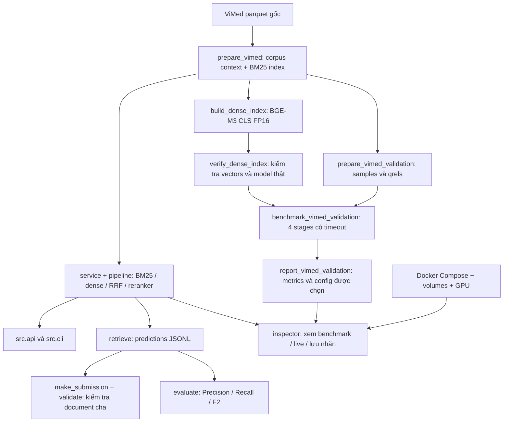

# Rà soát workflow và dọn workspace

## Các luồng được giữ

| Nhóm | File/thư mục giữ | Lý do |
|---|---|---|
| Dữ liệu | `data/raw/vimedaqa/`, `data/vimed/` | Có thể chuẩn bị lại corpus, validation và qrels |
| Index | `artifacts/vimed_bm25/`, `artifacts/vimed_dense_bge_m3_cls/` | Dùng trực tiếp trong retrieval/UI |
| Model | BGE-M3 revision `5617a9…`, reranker revision `953dc6…` trong HF cache | Khớp config và index đã kiểm chứng |
| Kết quả | `outputs/vimed_validation/`, `outputs/vimed_dense_build/`, `outputs/vimed_bm25/` | Benchmark, bằng chứng build và nhãn người dùng |
| Runtime | adapters, data, config, service, pipeline, retrieval, reranking, scoring, selection, evaluation, submission | Các dependency của workflow thật |
| Tests | Toàn bộ bộ test và fixtures demo/MedQuAD | Hồi quy schema, preprocessing, encoder, scoring, submission và UI |
| Tiện ích | CLI, converter MedQuAD, smoke runners, ablation, calibration engine, download helpers | Entry point hoặc tiện ích kiểm tra retrieval có mục đích rõ ràng; không xem “không có import” là bằng chứng đủ để xóa CLI |
| Docker | Dockerfile, Compose, requirements, dockerignore | Chạy UI với dữ liệu/index/cache được mount |
| Tài liệu | Báo cáo benchmark, encoder, Docker, tài liệu nghiên cứu và review | Bằng chứng và hướng dẫn; tài liệu cũ được xem là lịch sử |

## Các lỗi đã sửa khi review

1. `scripts/evaluate_vimed.py` gọi thẳng retriever nên bỏ qua reranker. Đã chuyển qua pipeline và lấy thứ hạng candidates đủ điều kiện sau rerank; có regression test.
2. UI chỉ đối chiếu ID câu hỏi và checksum rankings, chưa đối chiếu nội dung câu hỏi/qrels/corpus. Đã kiểm tra fingerprint samples, corpus và split; câu bị sửa nhưng giữ nguyên ID sẽ bị từ chối.
3. API JSON chạy chung pipeline giữa nhiều request. Đã thêm lock vì pipeline có trạng thái `last_candidate_scores` và model được chia sẻ.
4. `prepare_vimed` có thể biến NaN thành chuỗi `nan`. Đã xử lý giá trị thiếu bằng `pd.isna`, thống nhất với validation converter.
5. Script báo cáo có f-string chỉ parse được ở Python 3.12 trong khi project cho phép 3.11. Đã đổi cách quote tương thích.
6. Docker có scripts báo cáo nhưng không copy tài liệu mà script cần đọc. Đã bổ sung `docs/` vào image và build context.
7. README cũ mô tả demo chưa triển khai retrieval, hướng dẫn UI test cũ và có link tài liệu không tồn tại. Đã thay bằng workflow ViMed validation/UI/Docker hiện tại.

## Đã loại bỏ

| Phần bị loại | Bằng chứng/lý do |
|---|---|
| `src/indexing/build_index.py`, `dense_index.py` | Re-export/abstract scaffold, không dùng bởi index thật hoặc tests; dense thật ở `src/retrieval/dense.py` |
| `src/query/expand.py`, `medical_terms.py`, `__init__.py` | Query expansion chưa nối vào service/factory/adapter; normalization thật ở `src/data/preprocess.py` |
| `src/scoring/chunk_score.py` | Min-max helpers không dùng; pipeline dùng raw retrieval/reranker scores |
| `scripts/calibrate_threshold.py` | Chỉ in dòng “Ready for Day 6”, không calibration; giữ engine thật `src/selection/calibrate.py` |
| CUDA wheel Windows và thư mục parts | Torch CUDA đã cài và sử dụng; file cài đặt trùng lặp |
| Reranker parts và file `.incomplete` | Snapshot hoàn chỉnh đã được xác minh SHA256; các mảnh tải không được runtime đọc |
| BGE-M3 snapshot `9a0624…` | Revision cũ không được workflow ViMed đang khóa revision sử dụng |
| `artifacts/vimed_dense_probe/` | Index probe 128 chunks, không dùng bởi cấu hình hiện tại |
| `medical-rag/medical-rag/` | Thư mục lồng rỗng |
| Dependencies `rank-bm25`, `tantivy` | BM25 hiện dùng index nội bộ; Tantivy backend chưa triển khai và báo lỗi rõ ràng |

Dung lượng các targets đã xóa: **13.583.286.072 bytes (~12,65 GiB)**. Đây là tổng size file, không phải phép đo dung lượng trống của filesystem.

Danh sách và checksum nằm trong `outputs/cleanup_review/plan.json`. Bản sao nhỏ các source đã loại nằm ở `removed_source.zip` để có thể đối chiếu/khôi phục; dữ liệu cache dư không được lưu lại.

## Kiểm chứng

- Trước thay đổi: 115 tests pass; sau cleanup: **121 tests pass**. Giữ nguyên các tests cũ, bổ sung regression tests cho reranker, NaN, cache identity, import graph, schema configs và README links. Có 1 cảnh báo deprecation Starlette/AnyIO.
- Đối chiếu 57 file được bảo vệ: corpus, configs, index, snapshots model, benchmark và nhãn giữ nguyên checksum.
- Parse/import graph: 90 file Python; không có import nội bộ trỏ đến file đã xóa. Source/scripts parse được theo cú pháp Python 3.11; lint unused imports đạt sau khi bỏ thêm 3 imports không dùng.
- 16 cấu hình: dùng đúng schema Pipeline/Runtime hoặc SmokeConfig; các smoke E5 dùng schema riêng, không ép vào config runtime.
- Tính lại Recall/MRR của cả bốn stages từ rankings đủ 2.210 câu: khớp metrics gốc. Không chạy lại toàn bộ benchmark GPU hoặc tune trên test.
- UI startup và benchmark replay bốn stages được kiểm tra với dữ liệu thật.
- GPU sau cleanup: dense index đủ 17.955 vectors × 1.024 dimensions, finite/normalized; đối chiếu CLS reference đạt, batch/single nhất quán. Lượt đầu bị Windows window-CLOSE, lượt chạy lại đạt.
- API live trong một tiến trình kiểm tra hữu hạn chạy đủ BM25/dense/hybrid/reranker với model thật; câu `drug_6717` có context đúng ở hạng 1 với dense và reranker. Server nền bị Windows kết thúc, nên không khẳng định UI đang được giữ chạy ở localhost.
- Compose config hợp lệ. Docker engine chưa sẵn sàng ở lần kiểm tra trước; chưa xác nhận build/container chạy thật.
- Kết quả sau cùng của test, checksum và GPU được lưu ở `outputs/cleanup_review/`.

Test pass chứng minh các trường hợp được kiểm tra vẫn chạy đúng; việc xác định file thừa còn dựa vào import graph, entry point, cấu hình, tài liệu và artifacts. Không xóa một file chỉ vì không xuất hiện trong coverage.

## Giới hạn còn lại

- Benchmark có một context nguồn suy ra cho mỗi câu; chưa có nhãn relevance đầy đủ.
- UI chưa được kiểm tra trực quan toàn bộ; phiên Computer Use trước đã bị người dùng dừng.
- Benchmark có resume theo từng câu nhưng một dòng JSONL cuối bị ghi dở do crash có thể cần sửa trước khi resume.
- Cấu hình hiện tại cố định top 5; calibration engine được giữ nhưng chưa nối vào workflow chọn config.
- Reranker chỉ đổi thứ hạng trong pool 100; 166 câu validation vẫn thiếu context nguồn trong pool này.
